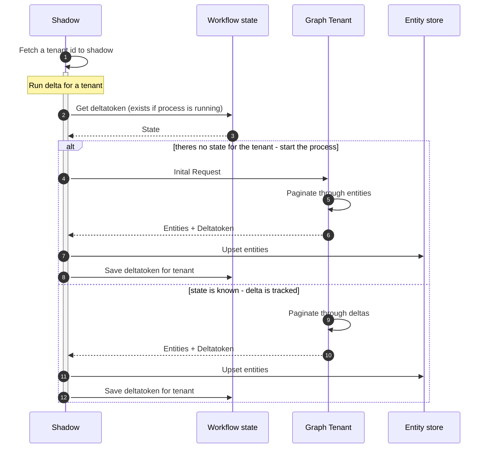

Pull data, using delta tokens

Below shows the overall delta process. For each tenant known to the SaaS solution, an initial request is made, return all the entities and a delta token. The delta token is used in next request, to get the changes since the delta token was issued. A new delta token is returned when using a delta token.
[Get incremental changes for users - Microsoft Graph | Microsoft Learn](https://learn.microsoft.com/en-us/graph/delta-query-users?tabs=http)

