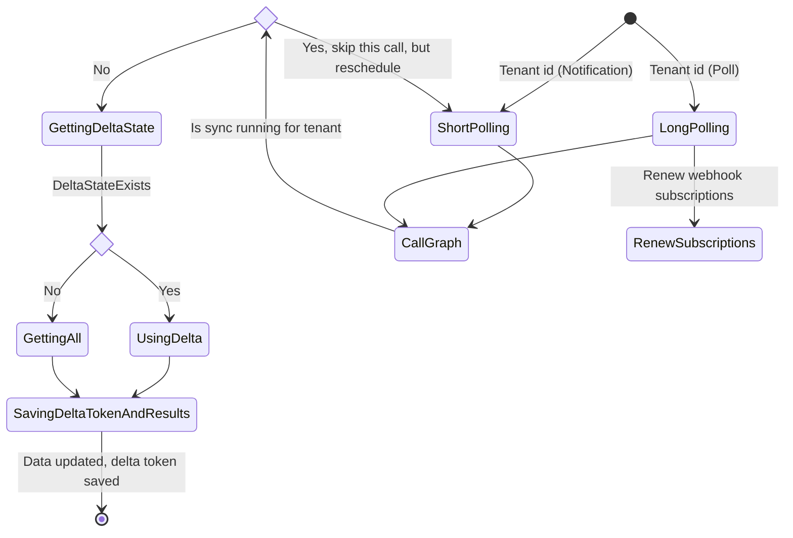

```mermaid
stateDiagram-v2
state if_state <<choice>>
state if_state2 <<choice>> 
[*] --> LongPolling : Tenant id (Poll)
[*] --> ShortPolling : Tenant id (Notification)


ShortPolling--> CallGraph 
LongPolling --> CallGraph
LongPolling --> RenewSubscriptions : Renew webhook subscriptions


CallGraph --> if_state : Is sync running for tenant
   if_state --> ShortPolling : Yes, skip this call, but reschedule
   if_state --> GettingDeltaState : No

GettingDeltaState --> if_state2 : DeltaStateExists
if_state2 -->UsingDelta : Yes
if_state2 -->GettingAll : No

UsingDelta --> SavingDeltaTokenAndResults
GettingAll--> SavingDeltaTokenAndResults
        
SavingDeltaTokenAndResults --> [*] : Data updated, delta token saved
```