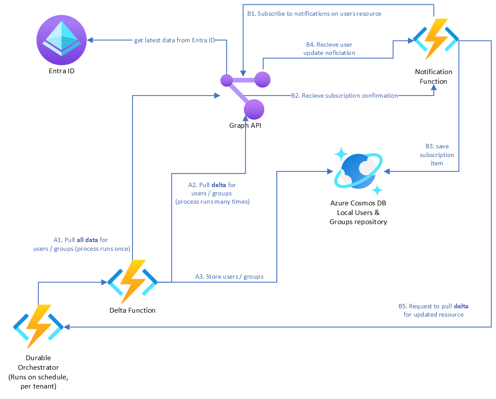
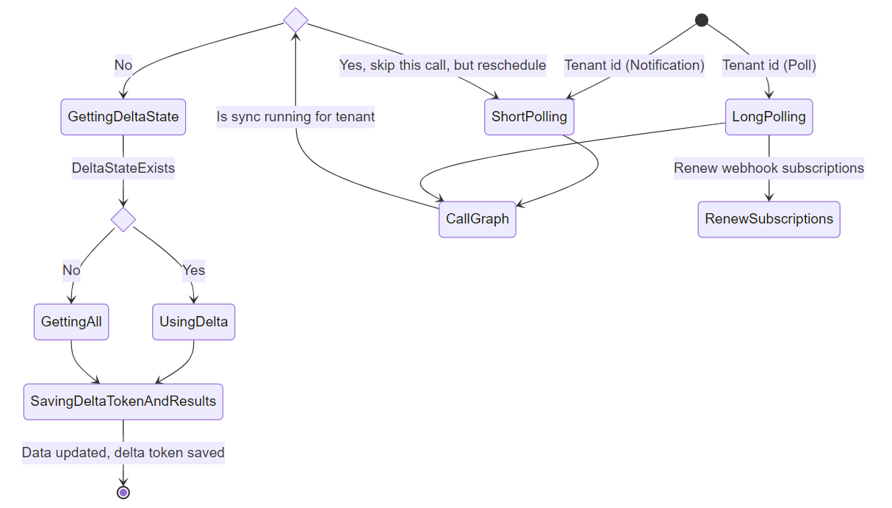
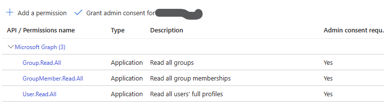

# Graph Shadowing

### Handling throttling efficiently, using delta retrieval and webhooks 

Throttling limits prevents excessive use that could potentially impact service availability. Most services applies some limits to ensure optimal performance and reliability. Microsoft Graph API applies a multilayered throttling approach with [service specific limits](https://learn.microsoft.com/en-us/graph/throttling-limits). 
Especially in multitenant cases, where solutions integrates with multiple Microsoft Graph tenants, there is a need for using Graph efficiently.

Common reasons for throttling include:

- **High Request Volume**: Exceeding the rate limit by sending numerous requests in a short time.
- **Resource-Intensive Queries**: Throttling may occur with complex or large data requests.
- **Tenant and Service-Level Limits**: Throttling can affect both individual tenants and the overall service, especially in multi-tenant environments like Entra applications.
- **Service-wide Demand**: Increased demand on Microsoft Graph can result in service-wide throttling.

Throttling is not deterministic. So designing for efficient access as well a having retry logic is key, to ensure reliable operations.

> It's possible to receive `429 Too Many Requests` responses even when the (following) limits aren't reached, in situations when the services are under an important load or based on data volume for a specific tenant.
> https://learn.microsoft.com/en-us/graph/throttling-limits

This sample shows data how an integration with Microsoft Graph can be created, which will maintain a replica of data, following the [Cache-Aside  pattern](https://learn.microsoft.com/en-us/azure/architecture/patterns/cache-aside). Eventual consistency is inherent in the sample. Following that design criteria provides a means to reduce the API calls issued to Microsoft Graph. 
Two main principles drives this sample:

* [OData delta.](https://learn.microsoft.com/en-us/graph/delta-query-overview) Delta query enables applications to discover newly created, updated, or deleted entities without performing a full read of the target resource with every request. Microsoft Graph consumers can use delta query to efficiently synchronize changes with a local data store.
  The first request will page through all entities. On the last page of the initial delta request, a delta token is present. This delta token can then be used in a following request, to retrieve changes since the token was issued. 
* [Webhooks](https://learn.microsoft.com/en-us/graph/change-notifications-delivery-webhooks?tabs=http). Change notifications enable clients to receive notifications when a Microsoft Graph resource they're interested in changes; that is, created, updated, or deleted. Microsoft Graph sends notifications to the specified client endpoint, and the client service processes the notifications according. Many notifications can be sent, if the source changes a lot. The solution registers change for a tenant, and instead of fetching the entity immediately, it signals a background job use the *delta* for the tenant on next run.

In summery, the main principle is, to use *OData delta tokens* in conjunction with *subscriptions (webhooks)* notifications. When a notification arrives for a tenant, its registered for 'later' processing. A scheduled background job then runs using the delta tokens, for the tenants registered. This approach reduces the calls to Graph, only using delta tokens, and not calling graph on every subscription triggered.

[Azure Durable functions and Orchestration](https://learn.microsoft.com/en-us/azure/azure-functions/durable/durable-functions-overview?tabs=in-process%2Cnodejs-v3%2Cv1-model&pivots=csharp) is used to persist delta tokens and subscriptions for each tenant. Cosmos DB persists the retrieved data, using partition key composed of tenant id and OData type.



### Main sample scenario 

SaaS companies often need to provide user and group management with their solution. If a local representation of the user and group is needed, then user provisioning can be applied, or Microsoft Graph can be used to query for data required by the SaaS solution. 

*This sample* specifically addresses scenarios where an local representation of users, groups and memberships is required. However, the sample can be fitted for other Microsoft Graph entities.

#### State diagram, putting it together

Below diagram, includes both delta and notifications and how they work together. There's two 'schedules / TimerTriggers' , a `ShortPolling` and `LongPolling`.



1) `LongPolling` runs a few times a day. If needed, this can run alone, as the only schedule.
2) `ShortPolling` is running every few minutes, and only executes a call to Graph, if a notification has been received since last run/poll.

To handle the scheduling, ensuring that the delta dance is only running one a time for a given tenant, the `ShouldCallGraph` reads the current workflows state for the tenant using `IDurableOrchestrationClient` to determine if the workflow is already running for the given tenant. Instance Id of the workflow equals the tenant id .


`GettingDeltaState` uses `IDurableEntityContext` (a durable function) to get the delta token for the tenant. If token exists its used, if it does not exist, a full retrieval is performed, paging over the data. Finally both the retrieved data and delta token is stored. The tenant id 

### Installation - bash, bicep

Bash scripts is provided. Please ensure the following prerequisites: `.NET8, zip, jq, az cli.  `

1) Clone the repository
2) Go the `Scripts`folder
3) Run `createEntraApp.sh`. This will create a new Entra App registration with the following scopes:
   
   These scopes are required for this sample, where users, groups and memberships are pulled from Microsoft Graph.
4) Run `provision.sh`. This will deploy required Azure Resources. You're prompted for Resource Group name.
5) Run `deploy.sh` to build and deploy to Azure.
6) Make not of the last output from the deployment. It contains instructions for adding a customer tenant to the solution. 

##### Running locally

The previous steps has created an appsettings.local.json file, which is included in the project. File contains variables needed to run the project.

1) Set startup project to `ShadowFunctions`  and run or debug. 

### Testing

A `HttpTrigger` has been added to the project. It provides a few endpoints to administer the durable work flows. URIs are available for the function in the Azure portal or in the console if running locally:

First, consent needs to be granted for tenants, for the data to be read:

> GET signup/{tenantId}
>
> This will drive the consent flow for the provided tenant.

Then, the tenant can be added to the shadow process as well as triggering and update, by calling the following function:

> GET orchestrators/manage/{tenantId}/{action}
>
> Action can be of the following:
>
> - addtenant
>   Add a tenant id (guid) to the system. 
> - removetenant 
>   Remove a tenant from the system (will not delete data, just the delta synchronization)
> - update
>   Will add a tenant id to the short polling list, including the tenant in the next schedule
>

Besides, application insights is also provisioned to capture telemetry. A key point of interest is Microsoft Graph throttling - dependency information in general is of interest here, to see interaction characteristics with Microsoft Graph. A simple query is to see response codes

```kql
dependencies
| where timestamp > ago(1d)
| where target == "graph.microsoft.com"
| where resultCode !in(200)
| summarize count() by bin(timestamp,15m), resultCode
```

Following gives a highlevel view of function executions:
```kql
union AppTraces
| where TimeGenerated >= ago(1h)
| order by TimeGenerated desc
| extend Category_ = tostring(Properties.Category)
| where Category_ startswith "Function"
| summarize count()  by Category_, AppRoleInstance
```

## Summary

Sample shows how to create a cache of users, groups and memberships, getting data from Microsoft Graph. The solution uses Azure Durable functions, to orchestrate retrieval using delta functions, as well as handling webhook subscriptions processing and renewal. 

Pattern can be adopted to other entities as well.

### Additional resources

Delta requests for OData and Microsoft Graph

* [Use delta query to track changes in Microsoft Graph data - Microsoft Graph | Microsoft Learn](https://learn.microsoft.com/en-us/graph/delta-query-overview)

* [Get incremental changes for users - Microsoft Graph | Microsoft Learn](https://learn.microsoft.com/en-us/graph/delta-query-users?tabs=http)

Subscriptions, webhooks for Microsoft Graph

* [Set up notifications for changes in resource data. - Microsoft Graph | Microsoft Learn](https://learn.microsoft.com/en-us/graph/webhooks)

* [Create subscription - Microsoft Graph v1.0 | Microsoft Learn](https://learn.microsoft.com/en-us/graph/api/subscription-post-subscriptions?view=graph-rest-1.0&tabs=http)

The API guidelines describes the pattern, using delta tokens and notifications as follows:

> **Change Tracking:**
> [When to use this pattern](https://github.com/microsoft/api-guidelines/blob/vNext/graph/patterns/change-tracking.md#when-to-use-this-pattern)
>
> API consumers want a pull mechanism to request and process change to Microsoft Graph data, either via proactive polling or by responding to Microsoft Graph notifications.
>
> API consumers need guaranteed data integrity over the set of changes to Microsoft Graph data.

Microsoft Graph throttling 

* https://learn.microsoft.com/en-us/graph/throttling-limits

* https://learn.microsoft.com/en-us/graph/throttling